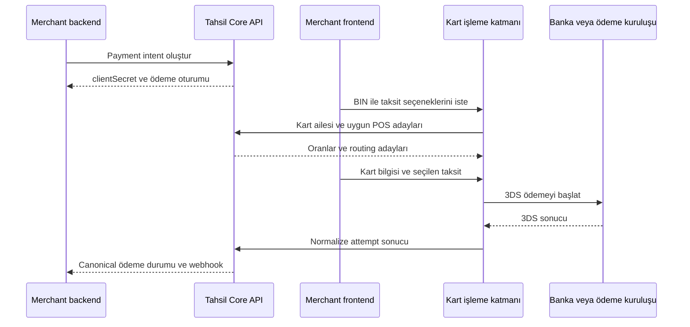

Tahsil Ödeme Orkestrasyonu, banka ve ödeme kuruluşlarıyla yaptığınız doğrudan
sanal POS sözleşmelerini ortak bir ödeme yaşam döngüsünde yönetir. Tahsil fon
tutmaz, para aktarmaz ve size sanal POS sağlamaz. Hangi kuruluşla çalışacağınıza
ve ticari sözleşmenize siz karar verirsiniz.

## Banka verisi ile ödeme aynı şey değildir

| Alan | Banka Verisi | Ödeme Orkestrasyonu |
| --- | --- | --- |
| Başlangıç | Bankada oluşmuş hesap hareketi | Merchant'ın başlattığı tahsilat isteği |
| Yön | Bankadan Tahsil'e veri okuma | Tahsil'den seçilen POS'a işlem gönderme |
| Ana kayıt | Hesap ve hareket | Payment intent ve değişmez attempt kayıtları |
| Kritik belirsizlik | Hareketin tekrar alınması | Bankanın işlemi kabul edip etmediğinin bilinmemesi |
| Güvenli tekrar | `providerStamp` ile çoğaltmama | `Idempotency-Key` ve canonical durum sorgusu |
| Sonraki işlem | Eşleştirme ve raporlama | İptal, iade, webhook ve durum mutabakatı |

İki alan aynı firma, yetkilendirme ve limit altyapısını kullanabilir; ancak veri
modeli ve hata davranışı ayrıdır. Başarılı bir ödemenin banka hareketiyle
eşleştirilmesi ayrı bir mutabakat problemidir.

## Ödeme akışındaki taraflar

- **Merchant backend:** Sipariş referansını ve tutarı belirler, payment intent
  oluşturur ve kesin durumu Core API'den okur.
- **Merchant frontend:** Tahsil'in verdiği kısa ömürlü oturumla taksitleri
  gösterir ve kart bilgisini kart işleme katmanına iletir.
- **Tahsil Core API:** Firma kapsamı, POS kayıtları, oran planları, routing
  kararı, payment intent, attempt, iade ve webhook durumunun sahibidir.
- **Tahsil kart işleme katmanı:** Kartın tamamını geçici olarak işler, seçilen
  POS adaptörünü çağırır ve 3DS dönüşünü normalize eder.
- **Banka veya ödeme kuruluşu:** Ödemeyi kabul eder, reddeder ya da teknik
  sonucu üretir; fon ilişkisi merchant ile sağlayıcı arasındadır.

## İlk sürümün sınırı

İlk sürüm 3DS satış, canonical durum sorgusu, settlement öncesi iptal ve başarılı
işlemde tam veya kısmi iadeyi kapsar. Non-3DS, pre-auth/post-auth, kart saklama,
tekrarlı ödeme, ödeme linki ve Tahsil checkout arayüzü kapsam dışındadır.

<CardGroup cols={2}>
  <Card title="Mimari ve güven sınırı" icon="shield-halved" href="/rehberler/odemeler/mimari-ve-guvenlik">
    Kart verisinin hangi bileşene girdiğini ve hangi verilerin saklandığını inceleyin.
  </Card>
  <Card title="İlk POS'u kurun" icon="money-check-dollar" href="/rehberler/odemeler/sanal-pos-kurulumu">
    Sağlayıcıdan aktivasyona kadar zorunlu sırayı uygulayın.
  </Card>
  <Card title="Ödeme oturumu" icon="code" href="/rehberler/odemeler/odeme-oturumu">
    Backend ve frontend sorumluluklarını adım adım bağlayın.
  </Card>
  <Card title="Durum yaşam döngüsü" icon="diagram-project" href="/rehberler/odemeler/durumlar-ve-idempotency">
    Hangi durumun kesin, hangisinin geçici veya belirsiz olduğunu öğrenin.
  </Card>
</CardGroup>
